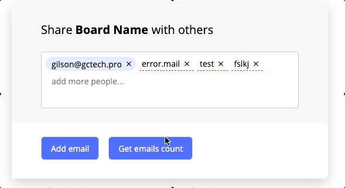
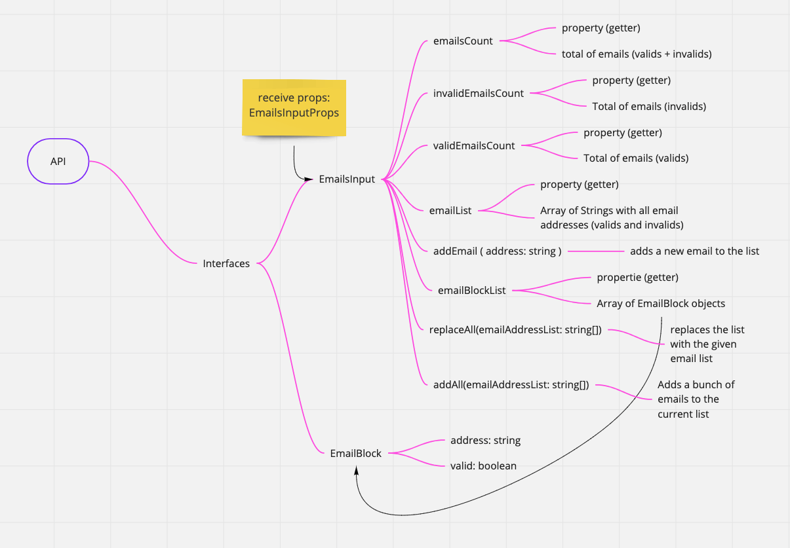

# EmailsInput component

### author: Gilson Cavalcanti (thanks to miro.com)

An experiment towards a "vanilla" web component with Typescript + webpack ie11 compatible

# Features & Tasks

- [x] Clipboard pasting - pastes comma separated text as emails
- [x] Email block should be created by pressing Enter, entering comma, or by losing focus on the input field. A Block can be deleted.
- [x] Adjusts itself to the space available in the mount node
- [x] Done with Typescript + Webpack (i know... not a feature, but a technical trait)
- [x] Auto scrolling if many emails
- [x] API with convenient methods
- [x] Isolated component: can use multiple in the same form
- [x] Styling with SASS
- [x] A prop to attach a listener to the list change events `onMailsListChange`
- [x] Fix - SVG fix in IE11
- [x] Fix - IE11 event listener for adding a new email not working properly

# The compiled component is a complete vanilla JS with cool features



# Live Examples:

[Link to the single sample](https://gilsoncav.github.io/emails-tags-input/dist/index.html)

[Link to the multiple component sample](https://gilsoncav.github.io/emails-tags-input/dist/emails-input__form-example_multiple.html)

# API draft:



# How to Use:

Put the compiled file found in `/dist/emails-input.js` reachable to your html file

You'll have to construct the `EmailsInput` object passing the "mounting node" (the HTML element you pretend to mount the component on):

```javascript
    (...)
    <script src="./emails-input.js"></script>
    <script>
      var options = {
        labelHTMLContent: 'Share <strong>Board Name</strong> with others',
        inputPlaceholderText: 'add more people...',
        // subscribing to changes
        onMailsListChange: (mailsBlockList) => {
          console.log(
            'This is how i listen to changes in the gct-emails-input component...'
          );
          mailsBlockList.forEach((eB) => console.log(eB.address));
        },
      };
      var inputContainerNode = document.querySelector('#emails-input');
      var input = new EmailsInput(inputContainerNode, { ...options });
      (...)
```

## GLOSSARY

### gct

You will stumble many times in this project with a "gct" namespace or prefix.
GCT stands for "Gilson Cavalcanti Technology" a ficiticious company that is runned me, myself and i
